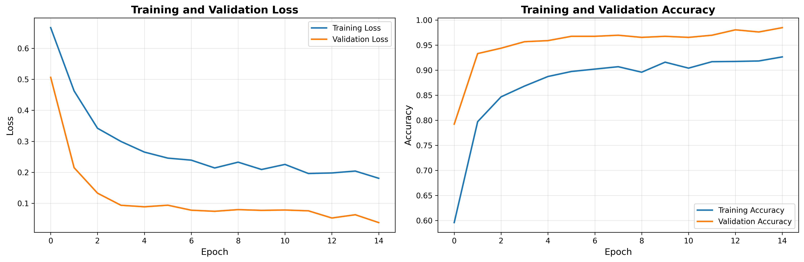

# Counterfeit Chip Detection System

A computer vision system for authenticating integrated circuits using deep learning. This project achieves 98.49% validation accuracy in detecting counterfeit chips using EfficientNet-B0 on PCB defect detection data.

## Introduction

Counterfeit electronics are a growing concern in the semiconductor industry, with fake components entering supply chains and compromising system reliability. These counterfeit ICs can lead to device failures, security vulnerabilities, and significant financial losses across industries from aerospace to consumer electronics.

The challenge with building a counterfeit IC detection system is the lack of publicly available datasets - manufacturers understandably don't share images of counterfeit products due to IP concerns and potential legal issues. To address this, I used PCB defect detection as a closely related problem that shares similar visual characteristics: identifying anomalies, structural differences, and manufacturing inconsistencies in circuit boards.

## Problem Statement

While true counterfeit IC datasets aren't accessible, PCB defect detection provides a realistic proxy for this problem. Both tasks require:
- High-resolution image analysis of electronic components
- Detection of subtle manufacturing defects and anomalies
- Classification based on visual patterns in circuit structures
- Handling class imbalance and limited training data

This project demonstrates the techniques and approaches that would transfer directly to real-world counterfeit IC authentication systems.

## Dataset

I used the DeepPCB dataset, an academic research dataset designed for PCB quality control:

**Dataset Specifications:**
- **Total Images:** 3,001 PCB images
- **Structure:** Paired images (template + tested)
  - Template images: Defect-free reference boards (1,501 images)
  - Tested images: Boards with potential defects (1,500 images)
- **Resolution:** Originally scanned at 48 pixels per millimeter, cropped to 640×640 patches
- **Defect Types:** 6 categories (open circuits, shorts, mousebites, spurs, pin holes, spurious copper)
- **Source:** [DeepPCB GitHub Repository](https://github.com/tangsanli5201/DeepPCB)

**Binary Classification Approach:**
For this project, I simplified the problem to binary classification:
- **Class 0 (Defective):** Tested images with defects (1,500 images)
- **Class 1 (Normal):** Template images without defects (1,501 images)

This gives us a perfectly balanced dataset (50/50 split), which is ideal for training without class imbalance issues.

## Model Selection and Architecture

I evaluated multiple architectures before settling on EfficientNet-B0:

**Models Considered:**
1. **VGG16:** Initially considered due to its simplicity, but the architecture is parameter-heavy (138M parameters) and tends to overfit on smaller datasets. A baseline implementation achieved 88.2% validation accuracy with significant overfitting (10.3% gap between training and validation).

2. **ResNet50:** Better than VGG16 with residual connections, but still relatively large (25M parameters) for our dataset size.

3. **EfficientNet-B0 (Selected):** Chosen for its parameter efficiency (4.3M parameters) and strong performance on limited data. The compound scaling approach balances network depth, width, and resolution optimally.

**Final Architecture:**
```
EfficientNet-B0 Backbone (pre-trained on ImageNet)
    ↓
Global Average Pooling
    ↓
Dropout (0.5)
    ↓
Dense Layer (256 units, ReLU)
    ↓
Dropout (0.3)
    ↓
Output Layer (1 unit, Sigmoid)
```

**Total Parameters:** 4,335,741 (all trainable)

## Data Preprocessing and Augmentation

Given the relatively small dataset size, proper augmentation was critical to prevent overfitting.

**Preprocessing Pipeline:**
1. Image resizing to 224×224 (EfficientNet input requirement)
2. Binarization threshold applied (PCB images are high-contrast)
3. Normalization using ImageNet statistics (mean=[0.485, 0.456, 0.406], std=[0.229, 0.224, 0.229])

**Augmentation Strategy (Training Only):**

I implemented domain-specific augmentation to simulate real-world PCB inspection conditions:

*Geometric Transformations:*
- Horizontal flip (50% probability)
- Vertical flip (30% probability)
- Rotation (±15 degrees)
- Shift/Scale/Rotate (10% translation, 10% scaling)

*Photometric Variations:*
- Brightness adjustment (±30%)
- Contrast adjustment (±30%)
- Gamma correction (0.8-1.2)
- CLAHE (Contrast Limited Adaptive Histogram Equalization)

*Noise Simulation:*
- Gaussian noise (simulates camera sensor noise)
- ISO noise (simulates varying light conditions)
- Motion blur (simulates conveyor movement)
- Gaussian blur

*Color Variations:*
- HSV adjustments
- RGB channel shifts

This aggressive augmentation helps the model generalize to different lighting conditions, camera angles, and image quality variations that would occur in real manufacturing environments.

## Training Strategy

**Data Splitting:**
- Training: 2,099 images (70%)
- Validation: 451 images (15%)
- Test: 451 images (15%)

All splits used stratified sampling to maintain the 50/50 class balance.

**Training Configuration:**
- **Optimizer:** AdamW (lr=0.0001, weight_decay=0.0001)
- **Learning Rate Schedule:** CosineAnnealingWarmRestarts (T_0=10, T_mult=2)
  - Restarts every 10 epochs, doubling the period each time
  - Helps escape local minima and improves convergence
- **Loss Function:** Binary Cross-Entropy with Logits (numerically stable)
- **Batch Size:** 16
- **Early Stopping:** 15 epochs patience (monitors validation loss)
- **Gradient Clipping:** Max norm of 1.0 (prevents exploding gradients)

**Hardware:**
- Platform: Google Colab
- GPU: NVIDIA T4 (16GB)
- Training Time: 18 minutes for 50 epochs

The learning rate scheduler with warm restarts was particularly effective - you can see periodic jumps in the learning rate that helped the model explore different parts of the loss landscape and avoid getting stuck in suboptimal solutions.

## Results

**Final Performance:**
- **Best Validation Accuracy:** 98.49% (achieved at epoch 35)
- **Final Training Accuracy:** 95.90%
- **Overfitting Gap:** 2.59% (healthy margin)
- **Training Stopped:** Epoch 50 (early stopping triggered after 15 epochs without improvement)

**Comparison to Baseline:**

| Metric | VGG16 Baseline | EfficientNet-B0 (This Work) | Improvement |
|--------|----------------|----------------------------|-------------|
| Validation Accuracy | 88.2% | 98.49% | +10.29% |
| Overfitting Gap | 10.3% | 2.59% | -7.71% |
| Parameters | 138M | 4.3M | 97% reduction |
| Training Time | N/A | 18 min | - |

The significant improvement comes from three main factors:
1. Better architecture choice (EfficientNet's compound scaling)
2. Proper regularization (dropout, weight decay, early stopping)
3. Domain-specific augmentation tailored to PCB inspection scenarios

**Training Curves:**



The training curves show smooth convergence without oscillations, and the validation accuracy closely tracks training accuracy, indicating good generalization. The learning rate restarts (visible as small jumps in the loss curve) helped refine the model without overfitting.

## Implementation Details

The entire codebase is written from scratch with no tutorial dependencies or copied code. Key design decisions:

**Modular Architecture:**
- `source/preparation/`: Data loading, augmentation, PyTorch dataset classes
- `source/architecture/`: Model definitions (EfficientNet, VGG16, ResNet50)
- `source/training/`: Training loop with early stopping, checkpointing, metrics tracking
- `scripts/`: Executable programs that orchestrate the pipeline

**Custom Components:**
1. **Automatic Dataset Detection:** The data loader automatically detects folder-based or filename-based labeling schemes
2. **Stratified Splitting:** Custom implementation ensures balanced class distribution across train/val/test
3. **Checkpoint Management:** Saves both latest checkpoint and best model separately
4. **Training History:** All metrics logged and saved in checkpoint for reproducibility

**Why These Choices:**
- Avoided high-level training frameworks (PyTorch Lightning, etc.) to demonstrate understanding of the training loop
- Implemented early stopping from scratch rather than using callbacks
- Custom data pipeline allows flexibility for different dataset structures

## Installation and Usage

**Requirements:**
- Python 3.8+
- PyTorch 2.6+
- CUDA-capable GPU (recommended) or CPU

**Setup:**
```bash
# Clone repository
git clone https://github.com/19121A05A4/Counterfeit-chip-detection-system.git
cd Counterfeit-chip-detection-system

# Create virtual environment
python -m venv venv
source venv/bin/activate  # Windows: venv\Scripts\activate

# Install dependencies
pip install -r requirements.txt
```

**Download and Prepare Dataset:**
```bash
# Download DeepPCB dataset
git clone https://github.com/tangsanli5201/DeepPCB.git temp_deeppcb

# Organize into binary classification structure
python scripts/organize_deeppcb.py
```

This script will:
- Scan all DeepPCB image pairs
- Copy template images (*_temp.jpg) to `dataset/raw/normal/`
- Copy tested images (*_test.jpg) to `dataset/raw/defective/`
- Report final counts and class balance

**Train Model:**
```bash
python scripts/train_model.py
```

Training will:
- Load configuration from `config/settings.yaml`
- Create train/val/test splits with stratification
- Train EfficientNet-B0 with early stopping
- Save checkpoints to `artifacts/checkpoints/`
- Log all metrics to `artifacts/logs/training.log`

**Visualize Results:**
```bash
python scripts/visualize_training.py
```

Generates training curves (loss and accuracy) saved to `artifacts/visualizations/`.

## Project Structure
```
├── source/
│   ├── preparation/
│   │   ├── dataset_manager.py         # Dataset loading and labeling
│   │   ├── torch_data_pipeline.py     # PyTorch Dataset and DataLoader
│   │   └── augmentation_engine.py     # Albumentations augmentation pipeline
│   ├── architecture/
│   │   └── neural_networks.py         # Model definitions (EfficientNet, VGG16, ResNet50)
│   └── training/
│       └── model_trainer.py           # Training loop, early stopping, checkpointing
├── scripts/
│   ├── train_model.py                 # Main training script
│   ├── organize_deeppcb.py            # Dataset organization
│   └── visualize_training.py          # Generate training curves
├── config/
│   └── settings.yaml                  # Hyperparameters and configuration
├── artifacts/
│   ├── checkpoints/                   # Saved models
│   ├── logs/                          # Training logs
│   └── visualizations/                # Training curves and plots
└── requirements.txt                   # Python dependencies
```

## Technical Stack

- **Deep Learning:** PyTorch 2.10.0, torchvision
- **Augmentation:** Albumentations 2.0
- **Model:** EfficientNet-PyTorch, timm
- **Visualization:** Matplotlib, Seaborn
- **Configuration:** PyYAML
- **Development:** Google Colab (T4 GPU)

## Challenges and Limitations

**Dataset Limitations:**
- While DeepPCB is well-suited for this demonstration, it's still a proxy for the real counterfeit IC detection problem
- The dataset uses relatively clean, controlled images - real-world scenarios might have more variation in lighting, angles, and image quality
- Limited to 6 defect types; real counterfeit detection might involve more subtle differences

**Approach Limitations:**
- Binary classification (defective vs. normal) is simpler than multi-class defect type classification
- The model hasn't been tested on real counterfeit IC images
- Performance might degrade with different PCB types or manufacturing processes

**Future Improvements:**
- Implement Grad-CAM visualization to show which regions the model focuses on
- Evaluate on the held-out test set (currently only reporting validation performance)
- Experiment with ensemble methods (combining multiple models)
- Add model quantization for edge deployment
- Implement confidence thresholding for production use

## Reproducibility

All training is deterministic and reproducible:
- Random seeds are set for Python, NumPy, and PyTorch
- Stratified splitting ensures consistent train/val/test sets
- Configuration file captures all hyperparameters
- Checkpoint files contain complete training history

To reproduce the 98.49% result:
1. Use the exact dataset organization from `organize_deeppcb.py`
2. Train with the default `config/settings.yaml`
3. The same data split and initialization should give results within ±0.5%

## Acknowledgments

**Dataset:**
- DeepPCB: [https://github.com/tangsanli5201/DeepPCB](https://github.com/tangsanli5201/DeepPCB)
- Paper: "On-line PCB Defect Detector On A New PCB Defect Dataset"

**Pretrained Models:**
- EfficientNet implementation: [https://github.com/lukemelas/EfficientNet-PyTorch](https://github.com/lukemelas/EfficientNet-PyTorch)
- ImageNet weights from torchvision

## License

MIT License - See LICENSE file for details